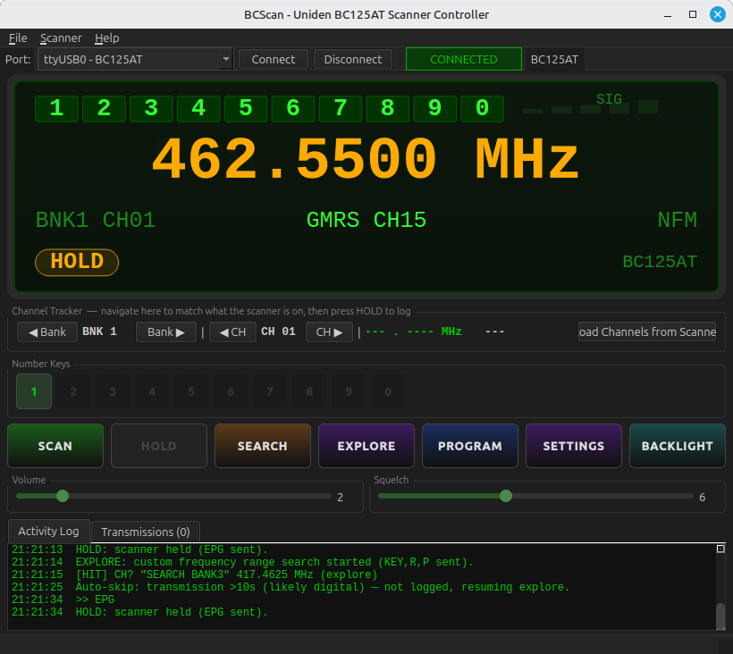
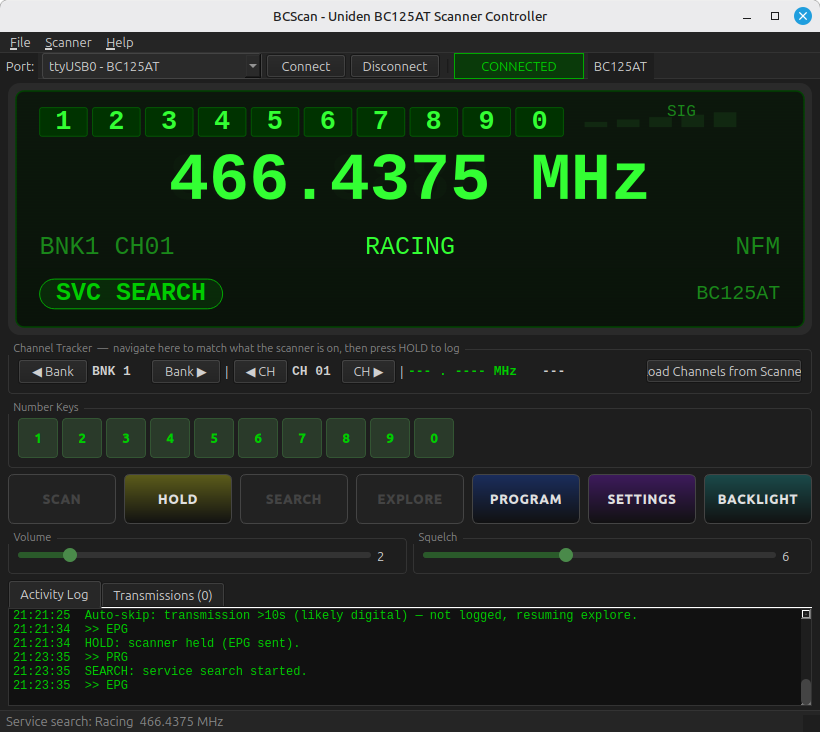
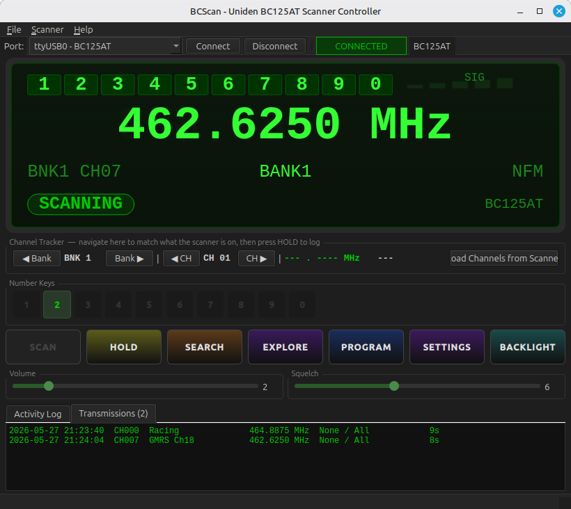

# BCScan



A desktop controller and programming application for the **Uniden BC125AT** handheld scanner, built with Qt.

Connect your scanner over USB, monitor activity in real time, program channels, and log transmissions — all from a clean, dark-themed interface that mirrors the scanner's LCD.

---

## Download

**[→ Download the latest release](https://github.com/jamesburnettio/BCScanner/releases/latest)**

Pre-built installers are available for Linux Mint / Debian (`.deb`), Fedora / RHEL (`.rpm`), and Windows (`.exe`).

All releases: [github.com/jamesburnettio/BCScanner/releases](https://github.com/jamesburnettio/BCScanner/releases)

---

## Table of Contents

- [Download](#download)
- [Features](#features)
- [Screenshots](#screenshots)
- [Requirements](#requirements)
- [Building](#building)
- [Scanner Compatibility](#scanner-compatibility)
- [Project Structure](#project-structure)
- [License](#license)

---

## Features

- **Real-time LCD mirror** — frequency, channel label, signal strength, and bank indicators update live via the scanner's `STS` command (4×/sec)
- **SCAN / HOLD / SEARCH / EXPLORE** controls with automatic state detection — buttons enable and disable based on what the scanner is actually doing
- **Service Search** — pick from Police, Fire/Emergency, HAM Radio, Marine, Railroad, Civil Air, Military Air, CB Radio, FRS/GMRS/MURS, and Racing; the app configures the scanner and starts searching
- **Explore** — triggers the scanner's custom frequency range search mode
- **Transmission logging** — hits are auto-detected when squelch opens; short blips and long digital bursts are filtered out (configurable thresholds); a per-session transmission log shows channel, frequency, CTCSS/DCS, and duration
- **Auto-skip / resume** — after a configurable timeout a long-running transmission is skipped and the scanner resumes the mode it was in (Scan, Explore, or Service Search)
- **Channel programming** — read, edit, and write all 500 channels with full CTCSS/DCS support
- **Channel cache** — bulk-load all 500 channels from the scanner for instant display while scanning
- **Number key buttons** — send `KEY,1,P` through `KEY,0,P` directly to the scanner; visually reflect which banks are active via STS field data
- **Volume / Squelch sliders** — live control without entering program mode
- **Backlight toggle**
- **Debug console** — serial monitor with STS field breakdown and a raw command console for testing undocumented commands
- **Settings** — serial port, log directory, auto-connect on startup, transmission duration thresholds, auto-skip timeout, service search group presets
- **Persistent window size and serial port** via `QSettings`

---

## Screenshots

**Holding on a GMRS channel with activity log**


**Service Search — Racing frequencies**


**Scanning with transmission log**


---

## Requirements

| Dependency | Version |
|---|---|
| Qt | 5.15 or 6.x |
| CMake | 3.16+ |
| C++ compiler | C++17 (GCC, Clang, MSVC) |

Qt modules used: `Core`, `Gui`, `Widgets`, `SerialPort`

---

## Building

### Linux (Ubuntu / Debian)

**1. Install dependencies**

Qt5:
```bash
sudo apt install git cmake build-essential qtbase5-dev qtserialport5-dev
```

Qt6:
```bash
sudo apt install git cmake build-essential qt6-base-dev qt6-serialport-dev
```

**2. Clone and build**

```bash
git clone https://github.com/YOUR_USERNAME/BCScanner.git
cd BCScanner
cmake -B build -DCMAKE_BUILD_TYPE=Release
cmake --build build --parallel
```

**3. Run**

```bash
./build/bcscan
```

**4. Serial port access (one-time setup)**

```bash
sudo usermod -aG dialout $USER
# Log out and back in for the change to take effect
```

The scanner appears as `/dev/ttyUSB0` or `/dev/ttyACM0`.

---

### Windows

#### Prerequisites (install once)

1. Download and run the **Qt Online Installer** from [https://www.qt.io/download-open-source](https://www.qt.io/download-open-source) (free account required)
   - Under the Qt version you want (6.x recommended, or 5.15), select:
     - `MSVC 2022 64-bit` **or** `MinGW 64-bit`
     - `Qt Serial Port` (listed under the same Qt version node)
   - Under **Developer and Designer Tools**, CMake is included — leave it checked

2. Install **Git** from [https://git-scm.com](https://git-scm.com)

#### Option A — Qt Creator (easiest)

```
1. git clone https://github.com/YOUR_USERNAME/BCScanner.git
2. Open Qt Creator
3. File → Open File or Project → select BCScanner\CMakeLists.txt
4. Qt Creator detects your installed kit automatically — click Configure
5. Click the Build button (Ctrl+B)
```

The executable is placed in `build\Release\bcscan.exe` (MSVC) or `build\bcscan.exe` (MinGW).

#### Option B — Command line with MSVC

Open the **x64 Native Tools Command Prompt for VS 2022**, then:

```bat
git clone https://github.com/YOUR_USERNAME/BCScanner.git
cd BCScanner
cmake -B build -G "Visual Studio 17 2022" -DCMAKE_PREFIX_PATH="C:\Qt\6.x.x\msvc2022_64"
cmake --build build --config Release
```

Replace `6.x.x` and `msvc2022_64` with your actual installed Qt version and kit folder name.

#### Option C — Command line with MinGW

Open the **Qt MinGW command prompt** (installed alongside Qt), then:

```bat
git clone https://github.com/YOUR_USERNAME/BCScanner.git
cd BCScanner
cmake -B build -G "MinGW Makefiles" -DCMAKE_BUILD_TYPE=Release -DCMAKE_PREFIX_PATH="C:\Qt\6.x.x\mingw_64"
cmake --build build --parallel
```

#### Creating a standalone distributable folder

After building, use Qt's `windeployqt` to copy all required DLLs next to the executable:

```bat
mkdir dist
copy build\Release\bcscan.exe dist\
cd dist
C:\Qt\6.x.x\msvc2022_64\bin\windeployqt bcscan.exe
```

The `dist` folder is fully self-contained — zip it up and distribute it. No Qt installation is required on the end user's machine.

The scanner appears as a `COM` port (e.g. `COM3`). Select it from the port drop-down in the toolbar.

---

### macOS

**1. Install prerequisites**

```bash
# Install Xcode command line tools
xcode-select --install

# Install Homebrew if not already installed
/bin/bash -c "$(curl -fsSL https://raw.githubusercontent.com/Homebrew/install/HEAD/install.sh)"

# Install Qt and CMake
brew install qt cmake
```

**2. Clone and build**

```bash
git clone https://github.com/YOUR_USERNAME/BCScanner.git
cd BCScanner
cmake -B build -DCMAKE_BUILD_TYPE=Release -DCMAKE_PREFIX_PATH="$(brew --prefix qt)"
cmake --build build --parallel
```

**3. Run**

```bash
open build/bcscan.app
```

Or directly from the terminal:

```bash
./build/bcscan.app/Contents/MacOS/bcscan
```

**4. Creating a distributable disk image**

```bash
$(brew --prefix qt)/bin/macdeployqt build/bcscan.app -dmg
```

This produces `bcscan.dmg` — a self-contained disk image ready to distribute.

The scanner appears as `/dev/tty.usbserial-*` or `/dev/tty.usbmodem*`. If the port list is empty, check **System Settings → Privacy & Security → USB**.

---

## Scanner Compatibility

Designed and tested with the **Uniden BC125AT**.

The application uses both standard documented commands and undocumented commands specific to the BC125AT firmware (notably the `STS` LCD-mirror command for real-time state detection). Other Uniden scanners with a similar serial protocol may work partially but are untested.

---

## Project Structure

```
BCScanner/
├── CMakeLists.txt           # Cross-platform build definition (Qt5 + Qt6)
├── bcscan.pro               # Alternative qmake project file
└── src/
    ├── main.cpp
    ├── mainwindow.*         # Main UI — controls, LCD mirror, log tabs
    ├── lcdwidget.*          # Custom LCD-style painter widget
    ├── scannerserial.*      # Async serial command queue (QSerialPort)
    ├── stspoller.*          # STS polling — real-time state, squelch detection
    ├── sqlpoller.*          # SQL latency squelch detector (legacy)
    ├── programwindow.*      # Channel programming dialog
    ├── settingswindow.*     # App settings dialog
    ├── debugwindow.*        # Serial monitor + raw command console
    ├── transmissionlogger.* # Hit recording and CSV logging
    ├── appsettings.*        # QSettings wrapper
    └── ctcssdcsdata.h       # CTCSS/DCS tone tables
```

---

## License

MIT License — see [LICENSE](LICENSE) for details.

Qt is used under the **LGPL v3** license. When distributed as a dynamically linked library (the default), no source-disclosure obligations apply to application code.
